# A guide to executing PPPwn with a GUI tool 
**Download** [PokersKun's GUI](https://github.com/PokersKun/PPPwn-Loader)   
**Download** [GOLDHEN by Sistr0](https://github.com/GoldHEN/GoldHEN/releases/tag/2.4b17)    

# PokersKun's GUI  
Download and unzip PokersKun's tool using either [7zip](https://www.7-zip.org/) or your preffered software  
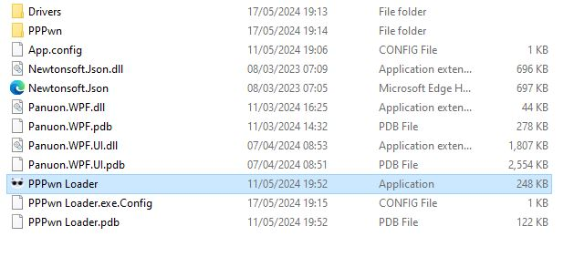   
Launch the **PPPwn Loader**  application  
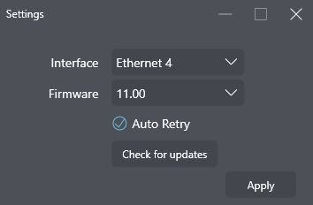  
You will be given some setup options   
1. **Interface**  
Sets your PC's ethernet adapter usually the default works if you are having issues try changing if others are available  
2. **Firmware**  
The latest is 11.00 as of the time of writing and is the default  
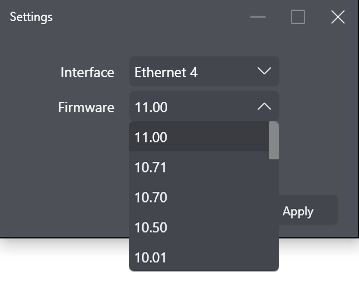  
Click on it to open the dropdown menu to change to the desired firmware  
**Auto Retry**
Enabled by default  
Allows for automatic retry of scanning for corrupted object  
**Check for updates**
Downloads the latest needed files  
**Apply**  
Click it to continue  
**To change these settings in the future click on the Wrench at the top right**  
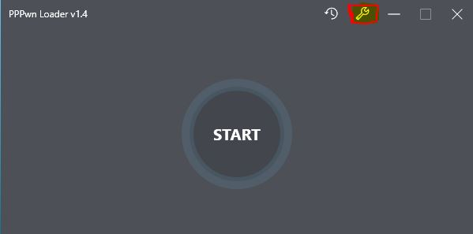    
  
**Choosing stage2.bin**  
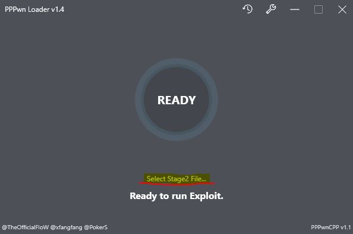    
Click on *Select stage2 file*  
It will open a new window  
Go to the directory where you unzipped the GUI  
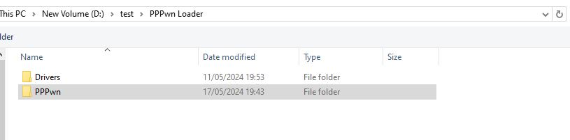  
Then go into the *PPPwn* Folder  
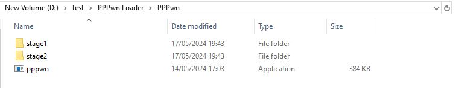  
Then go into the *stage2* Folder  
Then depending on the firmware you are on go into the corresponding folder  (11.00 will be used here)   
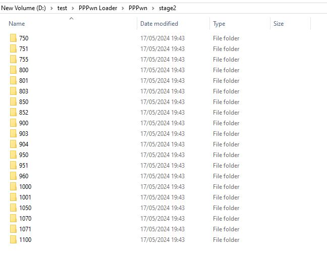  
Double Right click on the stage2.bin file  
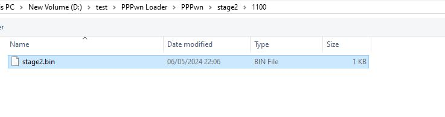  
The GUI is now ready to start the exploit  
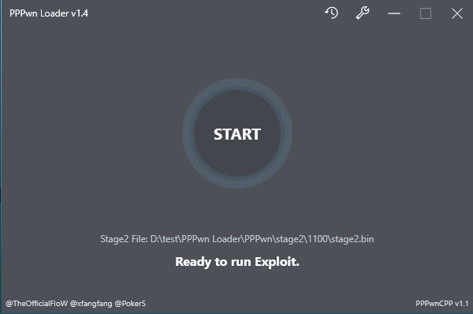  
  
# Setting up the PS4  
1. Go to **Settings** and then **Network**   
2. Select **Set Up Internet connection** and choose Use a **LAN Cable**  
3. Choose **Custom** setup and choose **PPPoE** for IP Address Settings  
4. Put in anything as the  **Username** and ***Password***   
5. Choose **Automatic** for *DNS Settings* and *MTU Settings*
6. Choose **Do not use** for *Proxy Server*   
7. Stay at the **Test Internet connection** Screen     

# Putting Goldhen on a USB      
Download [Goldhen](https://github.com/GoldHEN/GoldHEN/releases/tag/2.4b17) By SiSTR0    
And put the *goldhen.bin* on a USB formatted in exFAT or FAT32 and plug it into your PS4.

Windows has several built-in disk format tools that can be used to format a USB drive.  
**Windows File Explorer** To do this, open file explorer then right-click on the drive and select “Format”.  
**Windows Disk Management** This is a built-in utility that allows you to format a disk or a partition. To access it, go to Control Panel > System and Security > Administrative Tools > Computer Management. In the left pane, under Storage, select Disk Management. Right-click the volume you want to format and select Format.

Or you can use a 3rd party option like [partition wizard](https://www.partitionwizard.com/)   
 *Credit to [FalsePhilosopher](https://github.com/FalsePhilosopher)*    
  
# Executing the exploit   
Attach an ethernet cable to the PS4 and your PC  
  
Press *START* on the GUI  
**Notice** if the GUI is stuck on *WAIT* move the stage2.bin file to another location your desktop for example  
Then from the tool select it at it's new loaction  
Then on your PS4 Press X to **Test Internet connection**  
The exploit will run and also auto retry if you have the setting enabled  
  
# FAQ  
**PS4 unable to get IP**  
1. Try a different Ethernet cable  
2. If you have been using ethernet on your PC as an internet connection restart the PC   
3. Retry up to *20* to find an IP  
4. Make sure the tool is **Watiting for PADI** you can check from the *console*  
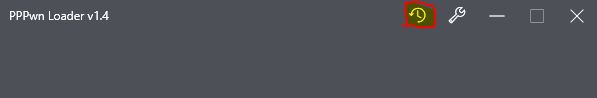  
  
**PS4 Retrying 30+ times**     
Unfortunately for now there is no specific fix for this  
1. Try another GUI tool  
*Placeholder for future guides and links*  

**PS4 Crashing at Defeating KASLR or just crashing to black screen**
1. Currently there is an issue where some consoles cannot be exploited no matter the amount of tries or bins used it is being investigated  
2. It is possible you are using the wrong stage2.bin  
3. Try another GUI tool    
*Placeholder for future guides and links*  
  
**No GOLDHEN after *PPPwned* message**  
1. Make sure your usb is either FAT32 or EXFAT try both formats  
2. Make sure you have the correct goldhen.bin on the usb and that it is not in any folders  
3. Make sure no other USB devices or controllers are plugged into the console    

# Full credit to  [PokersKun](https://github.com/PokersKun)  
More info on his github https://github.com/PokersKun/PPPwn-Loader  

